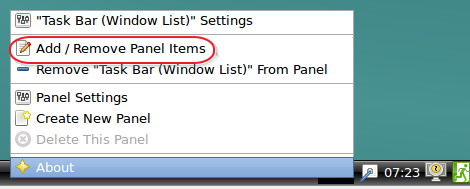
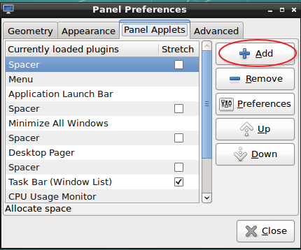
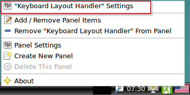
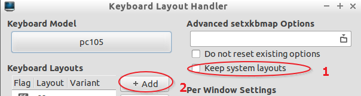
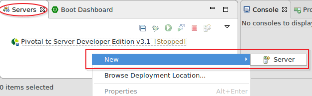
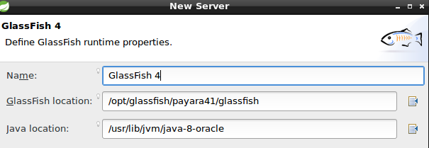

# Lab0. Configuration

Installation and configuration tools for the development of the course can be done in two ways: manually or automatically.

1. __Manually:__ Useful if the student wishes to acquire a deeper knowledge of necessary, or if you need a clean installation tools in your own environment.
2. __Automatically:__ An image is provided with the tools already installed. This option is a "_ready-to-go_" which eliminates inaccuracies when manual installation.

<!-- MarkdownTOC depth=3 -->

- [Automatically](#automatically)
  - [Step 1. Installation tools](#step-1-installation-tools)
  - [Step 2. Vagrant init](#step-2-vagrant-init)
  - [Step 3. Modify Vagrantfile](#step-3-modify-vagrantfile)
  - [Step 4. Start the image](#step-4-start-the-image)
  - [Change of language](#change-of-language)
  - [Step 5. Configure eclipse and Glassfish/Payara Server](#step-5-configure-eclipse-and-glassfishpayara-server)
- [Manual](#manual)

<!-- /MarkdownTOC -->


> Automatic installation shown in the first instance


## Automatically

### Step 1. Installation tools

For this scenario you need to install the following tools:

- VirtualBox ([http://www.virtualbox.org](http://www.virtualbox.org))
- Vagrant ([http://www.vagrantup.com](http://www.vagrantup.com)).
- Git bash: ([http://git-scm.com](http://git-scm.com)) __Only in the case of windows__
- Optional: VmWare, Parallels
- Optional but recommended in case of using VirtualBox
  - After installing vagrant open a bash console and type: `vagrant plugin install vagrant-vbguest`

### Step 2. Vagrant init

- After the installation is finished (Windows will require a reboot)
- Create a directory called _uc3mtiw_
- Open a bash console  (Git bash in windows) and type the following command in the created directory :
```ruby
vagrant init dpalomar/uc3mTiw
```

### Step 3. Modify Vagrantfile 

Open the generated file (__Vagrantfile__) and uncomment the following lines of code:

```ruby

   config.vm.provider "virtualbox" do |vb|
  #   # Display the VirtualBox GUI when booting the machine
     vb.gui = true
  #
  #   # Customize the amount of memory on the VM:
     vb.memory = "2048"
   end
```

__ATENTION:__ Notice how `vb.memory` has been changed the value of __1024__ to __2048__ This will increase the memory in the RAM on your computer.

> We recommend using 3072 or 4096. Try never exceed half the RAM on your computer.

### Step 4. Start the image

- Save the changes to the file and close the editor.
- Execute the command `vagrant up` in the console and waits until the graphical interface of the image starts.
- Once started, you can enter user __tiw__  _("IT technologies for the Web")_ and in the field _password_ introduces __tiw__.

> If you're out of the picture making a shutdown, you can always started again retyping __Vagrant up__ from the directory where is the file Vagrantfile

### Change of language

The default system language is American English, if you want to change the language to other follow these steps:

1. Right click on the bottom bar of the screen and select _Add/Remove Panel Items_  
2. Press the button __add__ 
2. Select _Keyboard layout handler_! [] (Images / Imagen1-2.png) and accepts
3. Right click the flag icon and _"Keyboard layout handler settings"_ 
3. In the new dialog follows the image: 
4. Look in the box that appears your language and click OK
5. Returning to the previous box moves the code language to the first position! [] (Images / Imagen4.png)
6. You have already translated the system.

### Step 5. Configure eclipse and Glassfish/Payara Server

1. Open Eclipse from  __menú inicio -> programming -> STS__
2. Create or accepts the working directory (it is recommended name it _workspace_ in a directory with permissions).
3. Click the right mouse button within the tab _Servers_  and choose __new -> Server__ 
4. Select __Oracle -> Glassfish Tools__ and click next to continue and begin downloading after accepting the license
5. When the download has finished a dialogue will appear indicating that you need to restart eclipse, press __YES__ .
6. Repeat step 3 and select this time __Glassfish -> Glassfish4 -> Next__
7. In the next dialog seek this route:
    8. __Glassfish location:__ /opt/glassfish/payara41/glassfish
    9. __Java Location:__ /usr/lib/jvm/java-8-oracle
    10. __Next__
    11. 
10. In the next screen, write down:
    11. __Admin Name:__ admin
    12. __Admin Password:__ admin
    13. __Next__
14. __Finish__

#### Testing Glassfish

> Let's try it all work:

1. Select the Glassfish server and press the green button (Start) 
2. When appears next to the server _(Started/Synchronized)_  open the following url in a browser: __http://localhost:8080__ and see you will see the  _Payara Server's_ welcome page
3. Press the red button to stop the server
4. Close eclipse/STS with __File-> Exit__

## Manual

For manual installation you will require the following steps:

1. [Install JDK8](http://www.oracle.com)
    2. Create the environment variable *JAVA_HOME* pointing to the installation _bin_ folder  
2. [Install maven](http://maven.apache.org)
    3. Create the environment variable *M2_HOME* pointing to the maven _bin_ folder
3. [Install Springsource ToolSuite](http://maven.apache.org)
4. [Install MySQL](http://www.mysql.com)
    5. User _root_ password _admin_
5. [Install MySqlWorkbench](http://www.mysql.com)
6. [Install Payara Server](http://www.payara.fish/)
    7. User _admin_ password _admin_
7. [Install MySql ConnectorJ](http://www.mysql.com)
    8. Unzip the file and put _mysql-connector-5.1.x-bin.jar_ in the directory *$PAYARA_INSTALACION/glassfish/domains/domain1/lib*
9. _Optional:_ [install Docker](http://www.docker.com)

> A minimum of 3Gb free RAM is recommended in order to run it correctly.


