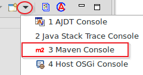
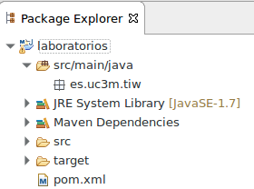
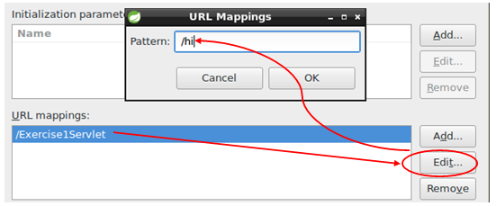
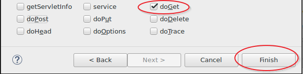
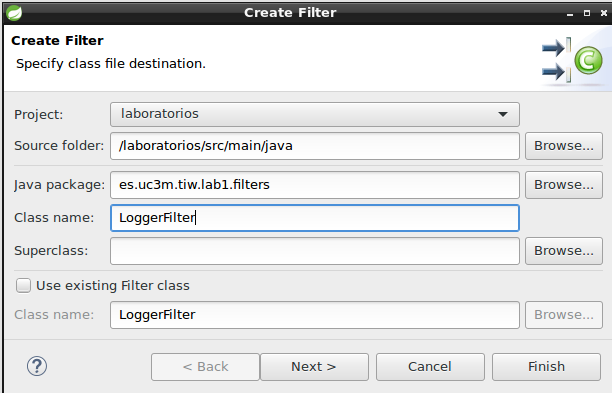
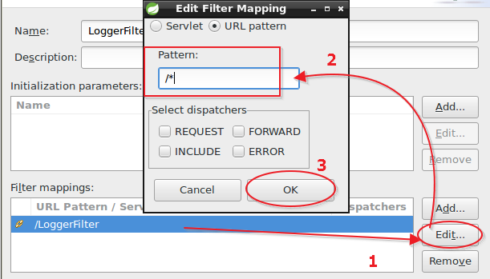

# Lab 1. Web development

<!-- MarkdownTOC -->

- [First project](#first-project)
- [Exercise1. HelloWorld](#exercise1-helloworld)
- [Exercise2. Headers](#exercise2-headers)
- [Exercise3. Parameters](#exercise3-parameters)
- [Exercise4. Parameters by POST](#exercise4-parameters-by-post)
- [Exercise5. JSP](#exercise5-jsp)
- [Exercise6. ServletConfig and attributes](#exercise6-servletconfig-and-attributes)
- [Exercise7. Sessions](#exercise7-sessions)
- [Exercise8. Filter logger](#exercise8-filter-logger)
- [Exercise9. Filters, Sessions, Petitions and Context](#exercise9-filters-sessions-petitions-and-context)
- [Exercise10. Taglibs, Expression Language and domains](#exercise10-taglibs-expression-language-and-domains)


<!-- /MarkdownTOC -->


## First project

1. Open a command console ( __Ctrl + Alt + t__ )
2. Create a directory called _tiwlabs_ : ( __mkdir tiwlabs__ )
3. __cd tiwlabs__
4. Enter the following command :

```shell
  mvn archetype:generate -DarchetypeGroupId=org.codehaus.mojo.archetypes -DarchetypeArtifactId=webapp-javaee7
```
 
Answer the questions that appear as follows (press enter to move to the next question):

        Define value for property 'groupId': : es.uc3m.tiw
        Define value for property 'artifactId': : laboratories
        Define value for property 'version':  1.0-SNAPSHOT: :  (press Enter to accept)
        Define value for property 'package':  es.uc3m.tiw: :   (Enter)
        Confirm properties configuration:
        groupId: es.uc3m.tiw
        artifactId: laboratories
        version: 1.0-SNAPSHOT
        package: es.uc3m.tiw
         Y: :  (write Y and press Enter)
 

After the following successful message appears :

```

[INFO] ----------------------------------------------------------------------------
[INFO] Using following parameters for creating project from Archetype: webapp-javaee7:1.1
[INFO] ----------------------------------------------------------------------------
[INFO] Parameter: groupId, Value: es.uc3m.tiw
[INFO] Parameter: artifactId, Value: laboratories
[INFO] Parameter: version, Value: 1.0-SNAPSHOT
[INFO] Parameter: package, Value: es.uc3m.tiw
[INFO] Parameter: packageInPathFormat, Value: es/uc3m/tiw
[INFO] Parameter: package, Value: es.uc3m.tiw
[INFO] Parameter: version, Value: 1.0-SNAPSHOT
[INFO] Parameter: groupId, Value: es.uc3m.tiw
[INFO] Parameter: artifactId, Value: laboratories
[INFO] project created from Archetype in dir: /home/tiw/tiwlabs/laboratories
[INFO] ------------------------------------------------------------------------
[INFO] BUILD SUCCESS
[INFO] ------------------------------------------------------------------------


```  


You'll have already a project created.

### Import the project in eclipse


1. Open STS
2. Open the maven's console  in the tab at the bottom  :
3. 
4. File -> Import -> Maven -> Existing Maven projects -> Next
5. Browse button . Locate the generated project  (/home/tiw/tiwlabs/laboratories) and add project to working set (laboratories)-> Finish
6. You will see how maven download all the necessary dependencies to configure the project .
7. When finished you will see a structure created with the M of mave and the J of java
8. 


## Exercise1. HelloWorld

Let's get started with the development of Servlets with a first example :


1. First change the perspective :
    2. Click on the upper right corner in the _Open perspective_ button
    3. 
    4. Select __Java EE__
    5. 
2. Right click on _laboratories->Java Resources->src/main/java->es.uc3m.tiw_ and select __New Package__
3. Enter the following package name: __es.uc3m.tiw.lab1__
4. On the new package (_es.uc3m.tiw.lab1_) right click and select __New -> Servlet__ and call it __Exercise1Servlet__
5. 
6. Change the __URL mapping__ in the following screen:
7. 
8. On the next screen select only the __doGet__ method and click Finish
9. 
10. Remove the auto-generated code within the __doGet__ method and type the following :

```java
    protected void doGet(HttpServletRequest request, HttpServletResponse response) throws ServletException, IOException {
        PrintWriter out = response.getWriter();
        out.println("Hi");
        out.close();
    }

```


11. Save the changes and start the Glassfish server
12. Right-click on the project __laboratories__ and select __Run As -> Run on Server__
13. Select the __Glassfish__ server on the next screen, click _Next_ and _Finish_
14. After a few moments the default browser will open and you will see a message __Hello World__ , but that's not the message we have written:
15. Enter the following URL in your browser: __http://localhost:8080/laboratories/hi__ and see the actual message.
16. You just finished the first year.

## Exercise2. Headers

> We start from the knowledge acquired in the previous exercise. This time we are going to extract and display all the information found in the client's headers.

> First we will fix a problem that appears at the bottom tab _"Markers "_ indicating that the project uses java version 1.7 and we have java 1.8 installed.

- Open the eclipse console : __Menu Window->Show View->Console__
- In the console tab, shows maven's console as you did in the previous exercise.
- Open the file __pom.xml__ from the laboratories project (_double click on the file_)
- In the editor that appears click on the __bottom tab pom.xml__ to see the source code.
- Locate the following code

```xml
            <plugin>
                <groupId>org.apache.maven.plugins</groupId>
                <artifactId>maven-compiler-plugin</artifactId>
                <version>3.1</version>
                <configuration>
                    <source>1.7</source>
                    <target>1.7</target>
                    <compilerArguments>
                        <endorseddirs>${endorsed.dir}</endorseddirs>
                    </compilerArguments>
                </configuration>
            </plugin>
```

- Change the values _source and target_ from 1.7 to 1.8

```xml
                    <source>1.8</source>
                    <target>1.8</target>
```

- Select the Laboratories project with the right mouse button and select __Maven->Update Project->Ok__
- All errors will be removed and the project will be configured with JDK 1.8
- You can close the pom.xml

> Now we begin with the development of the exercise.


1. Create a new servlet named __Exercise2Servlet__ in the package _es.uc3m.tiw.lab1_
2. In the _URL mapping_ change the string by __headers__
3. Select the method __doGet__
4. Write the needed code to get all headers from the client that connects to the browser code.
5. Extract also information about their connection address , requested URL , the protocol used ,  the server to which they have been connected and the language used.

> To extract all the information you need API documentation Java servlet specifically [ServletRequest](http://docs.oracle.com/javaee/7/api/javax/servlet/ServletRequest.html) and [HttpServletRequest](http://docs.oracle.com/javaee/7/api/javax/servlet/http/HttpServletRequest.html)


## Exercise3. Parameters

> This time we are going to reuse the code of exercise 1

1. Create a new servlet in the package _lab1_ called __Exercise3Servlet__
2. In the _URL mapping_ changes the string by __/parameters__
2. Copy the code of exercise 1
3. Create the needed code to the servlet that this time will print the message : _Hi name_ where _name_ it is dynamically inserted by *[Query_string](https://en.wikipedia.org/wiki/Query_string)*
4. The access URL will be : `http://localhost:8080/laboratories/parameters?name=John` In this case, the servlet will response : _Hi John_.

> For this exercise you will need the documentation of the class [HttpServletRequest](http://docs.oracle.com/javaee/7/api/javax/servlet/http/HttpServletRequest.html)

## Exercise4. Parameters by POST

1. Create a new servlet named __Exercise4Servlet__
2. __URL Mapping__ : __/login__
3. Select __doPost__ and __doGet__
4. Create the code for a form that send data to the login servlet. Do it within the method __doGet__

```html
    <form action="login" method="post">
        <fieldset>
            <legend>Login</legend>
            <label for="nom">Nombre:</label>
            <input type="text" id="nom" name="nombre"/> 
            <br>
            <label for="password">Clave</label>
            <input type="password" id="password" name="clave"/>
            <br>
            
        </fieldset>
        <input type="submit" value="Enviar">
    </form>
```

5. The servlet must validate the user and password, sending a positive response in a favourable case and another in case of error in the method __doPost__ .
    6. Responses should be with __text/html__ header and formatted code
    7. The user is valid : __user1__ with __password1__
    8. The valid response should greet the user with their username
    9. The invalid response should display a message indicating that they have no access and a link to return to the login form


> Necessary Documentation [HttpServletRequest](http://docs.oracle.com/javaee/7/api/javax/servlet/http/HttpServletRequest.html)

## Exercise5. JSP

> Incorporate html within the servlet itself is not very suitable .In this exercise we will extract the html code and serve it from dynamic pages.

1. Create a JSP page named __login.jsp__  within __laboratories->Deployed Resources->webapp__  with __botón right->New->JSP File__
2. Incoporate the html code from the page _login.html_
3. Create two more jsp pages:
    4. __list.jsp__ : contain the code showing the __Exercise4Servlet__ if the user exists
    5. __error.jsp__ : show the current error message __Exercise4Servlet__
6. Delete the code you have incorporated into the _Exercise4Servlet_ jsps and replace it by a _RequestDispatcher_ making a __forward__
7. Rename the _Exercise4Servlet_ to __LoginServlet__ (Click with the right button on the Exercise4Servlet class and select _Refactor- > Rename_ )

> With this we achieve separate the business logic from the presentation. For this exercise you will need documentation from
[RequestDispatcher](https://docs.oracle.com/javaee/7/api/javax/servlet/RequestDispatcher.html)

## Exercise6. ServletConfig and attributes

> In this exercise _LoginServlet_ servlet will load a list of usernames in the _init(_) method and make it available through the _request_ object to the page _list.jsp_ that get through the list and print a table with the users names.

1. Create an `ArrayList` of Strings in the `init(ServletConfig config)` method and fill it up with several users names.
2. When the user will be valid send forward to the list page within the users data .
  3. You will need to modify the request object to add attributes.
4. On the __list.jsp__ page retrieves the attribute from the list and write in a dynamic table with the data from the ArrayList

> For this exercise you will need documentation from [ServletRequest](http://docs.oracle.com/javaee/7/api/javax/servlet/ServletRequest.html) in particular `getAttribute` and `setAttribute`

## Exercise7. Sessions

> The objective of this exercise is that the user does not have to use again and again the login form to access the list of names if he has already authenticated.

1. Create a `HttpSession` in __LoginServlet__ and adds a token to the session with the value `authenticated=true` if the user is correct and `authenticated=false` otherwise
2. LoginServlet should check if the user has already authenticated can access directly or otherwise return to the login form.
    3. In this case , add an attribute _"message"_ to the request and this message must be read in the _login.jsp_ page.
    4. The message should show that the user is invalid

> The documentation in this exercise will be the API [HttpSession](https://docs.oracle.com/javaee/7/api/javax/servlet/http/HttpSession.html)

## Exercise8. Filter logger

> Let's create a filter that allows us control and trace every  step of the user. We will reuse part of the code of exercise 2 servlet headers .

1. Create a new package in `es.uc3m.tiw.lab1.filters`
2. Create a new filter in the former package (New-> Filter)
3. Called: __LoggerFilter__
4. 
5. Press __next__ and on the next screen changes the _URL Pattern_ by __/*__ 
6. 
7. __Next->Finish__
8. Within the method ` doFilter` put the necessary code and finish it with `chain.doFilter(request,response)`

> The filter should show in the console user's browsing history like this : `<date> - <ip> - <protocol> - <method> - <url>` . An advanced filter would record these data in a system log , but we just print it in the console for laboratory purposes  .


> Now when navigating normally you will see all your movements in the console in this way :

```
26-08-2016 11:28:37 - 0:0:0:0:0:0:0:1 - HTTP/1.1 - GET - http://localhost8080/laboratories/login
26-08-2016 11:28:50 - 0:0:0:0:0:0:0:1 - HTTP/1.1 - POST - http://localhost8080/laboratories/login
26-08-2016 11:29:32 - 0:0:0:0:0:0:0:1 - HTTP/1.1 - GET - http://localhost8080/laboratories/headers
```

## Exercise9. Filters, Sessions, Petitions and Context

> Although we allow users do not need to go through the login form through sessions , that does not prevent a user who knows the  _list.jsp_ page is able to access directly without authentication.
>
> So in this exercise it aims to control access to _list.jsp_ page via a filter that checks if the user has the authentication token session.
>
> __NOTE:__ Although  authentificated users will be able to access directly to _list.jsp_ page it will return a _NullPointerException_ because is unable to read the list of users that the _LoginServlet_ send by request . It is proposed to improve the code to control this error or incorporate the users list in the _context_ .
>
> In this exercise you can see the differences between :
> - Requests
> - Sessions
> - Filters
> - Context

1. Create a new filter in the package _filters_
2. Named it: __SecurityFilter__
3. URL pattern: __/list.jsp__
4. Add the necessary code in the __doFilter__ method to control whether the user has a session to access, otherwise redirect him/her to the login.

## Exercise10. Taglibs, Expression Language and domains

> In this exercise we will refactor our views adding Expression Language (__[EL](https://uel.java.net/)__) and using Taglibs __[JSP Standard Tag Library (JSTL)](https://jstl.java.net/)__  to improve them.
> We will also get data from the users array to make it more dynamic and functional with a layer of domain objects .

1. Modify the code __login.jsp__ replacing all the java code by jstl and EL
2. Do the same with the __list.jsp__ page
3. Create a __regular java class__ called __User__ in a new package _es.uc3m.tiw.lab1.domains_  that has the following properties and their corresponding get/set methods:

```java
    String name;
    String surname;
    String user;
    String password;

    public String getName() {
        return nombre;
    }
    public void setName(String name) {
        this.name = name;
    }
    ...
```

4. Modify the code __LoginServlet__ so that now:
    5. Contain a list of User objects already created
    6. Have a new logic that allows access to any user/password defined on that list
    7. Pass to the user object authenticated in session to be received by any page he/she have access.

