# Lab2. Object persistence

> The following exercises showalternatives to handling persistent data, in this case, in a relational environment through two alternatives:
> - An initial and more classic as it is __JDBC__
> - A second and more oriented to JEE as __JPA__
>
> Requirements: Having a relational database installed.


<!-- MarkdownTOC depth=3 -->

- [Exercise1. JDBC](#exercise1-jdbc)
- [Exercise2. JPA](#exercise2-jpa)
    - [1. Convert the project to JPA](#1-convert-the-project-to-jpa)
    - [2. Create JPA code](#2-create-jpa-code)
    - [3. Create the DataSource](#3-create-the-datasource)
    - [4. Start the application](#4-start-the-application)
- [Exercise3. Relations](#exercise3-relations)
- [ANNEX:](#annex)
    - [Work in Eclipse with JPA](#wrok-in-eclipse-with-jpa)
    - [JPA Designer](#jpa-designer)

<!-- /MarkdownTOC -->


## Exercise1. JDBC

> This is an example rather than an exercise to demonstrate the use of JDBC and subsequent comparison with JPA.
>
> Look at the code solutions to understand the explanations.

1. Modify the domain __User__ to add a new field `int id` which identifies the primary key
2. Create a new package structure:

```
es.uc3m.tiw
        ../lab2
            ../daos
            ../servlets
```

3. Incorporate into the package DAOs, :
    4. An _interface_ called __UserDAO__ that define operations
    5. and a class that implements this interface to be called __UserDAOImpl__ that contains the actual operations against the database.

> If you look at the code, it contains the basic methods of a [CRUD](https://en.wikipedia.org/wiki/CRUD) (add, delete and  modify), plus a couple of methods to handle connections.
>
> The __UserDAOImpl__ class has the JDBC code to insert and retrieve data from the database (_Statement, PreparedStatement, ResultSet and Connection_)

4. Create a new class called __Connector__ and a plain text file: __persistence.properties__

> The Connector class manages connections to multiple databases and uses a [Singleton pattern](https://en.wikipedia.org/wiki/Singleton) pattern to return a single instance. In order to make flexible connections to multiple databases locally or remotely with a  [DataSource](https://en.wikipedia.org/wiki/Datasource), this class makes use of a .properties file
>
> The _persistencie.properties_ file is invoked by both the connector and by the DAO, which allows modification values from databases, drivers, connections, and statements without recompiling classes, and it is loaded by the [ResourceBundle](https://docs.oracle.com/javase/7/docs/api/java/util/ResourceBundle.html) object.
>

5. You must change the __LoginServlet__ code by eliminating the creation of the user list in memory and use DAO to get users directly from the database.
    6. This connector uses the class and passes the connection and ResourceBundle object to the DAO.
    7. In the example the servlet retrieves the connection of a remote DataSource. You should have to create it on the server beforehand.

> Now all we have to do is to create the table __USERS__ in the database schema __tiw__ with columns matched to the properties of the __User__ class for everything to work properly.
>

6. Finally, you should create the necessary infrastructure to insert and modify users in that table, using web forms. To do this you will need:
    7. A new Servlet: __UserServlet__
    8. Two new pages: __addUser.jsp__ and __editUser.jsp__

> Both pages send data at the same servlet and a hidden field with a message that informs the servlet on what action to do: insert or update.
>
> In the solutions you will find that the code is not fully functional and unfinished, but you can get a good idea of what it should look

like, and if you want you can complete it.
>

> This scenario is a complete __MVC__, where controllers (Servlets) receive actions, execute business logic and redirect to new views or move the actions to the persistence layer, the views are kept separate from the database and obtain the information from the controllers.

## Exercise2. JPA

> This time we will refactor the project to insert JPA.
> Some disadvantages of JDBC are:
>
> - Workflow of the work is too rigid
> - Prone to failures (sentences as strings, try-catch)
> - Mix of technologies (OOP and SQL)
> - A lot of infrastructure/complexity for simple sentences
> - Required use of external resources outside of JDBC to improve work (patterns, ResourceBundles)
> - Difficult perform object-relational mapping
> - Low scalability
>
> For all this, it is recomended in projects to use an ORM framework.


> __NOTE:__ In many projects is used an infrastructure based on modules, declaring a reusable module for persistence, which would require the creation of a new utility project and make the necessary settings because the web project incorporates the persistence as a library.
On this occasion and for simplicity it is suggested to incorporate all laboratories persistence within the project as a package, remembering that what we discussed above is recommended.

### 1. Convert the project to JPA

> We will use the eclipse's tools that facilitate development with JPA.

1. Right click on the laboratories project and select : __Configure-> JPA project to convert ...__
2. In the dialog that appears make sure that Glassfish is selected as Runtime
3. 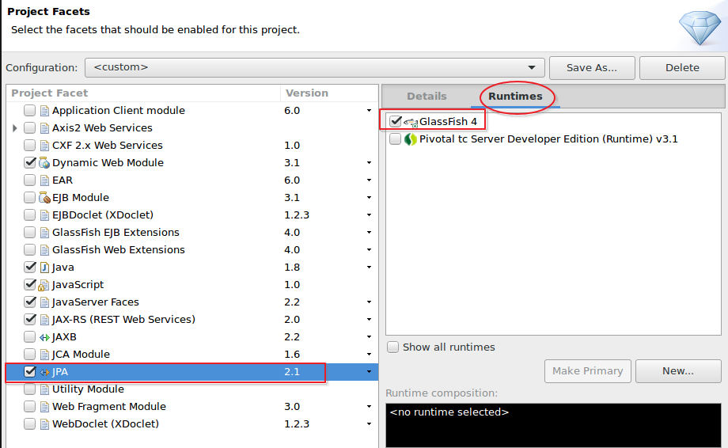
4. Press __Next__ and set the values as shown in the following screen:
5. 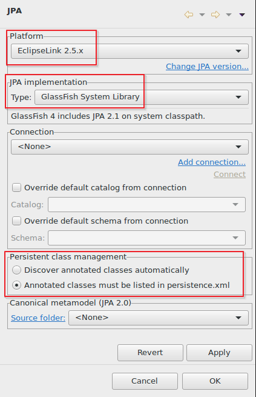
6. Press __Finish__ and it will generate a new __persistence.xml__ descriptor within a __META-INF__ directory. Open it with a double click.
7. 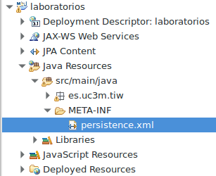
8. In the window that appears change these values:
    9. __name: __ laboratoriesPU
    10. __Persistence Provider: __ org.eclipse.persistence.jpa.PersistenceProvider
    11. __Managed classes: __ adds user domain
12. 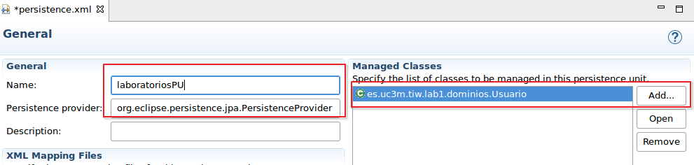
13. At the bottom of the editor changes the __Connection tab__ and apply the following values:
14. 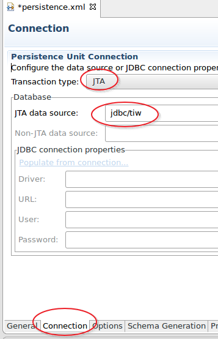
15. Switch to __options tab__ and modify the value _Loggin level_ to __Fine__
16. 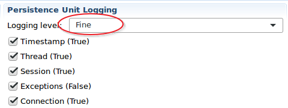
17. In the __Schema Generation tab__ modify the value to __Create__
18. 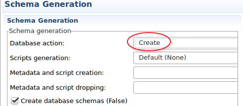
19. In the __Properties tab__ add a new property as follows:
20. 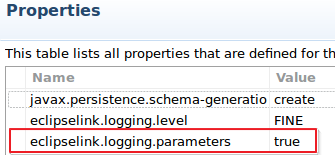
21. Save changes


You should have a code that looks like the following (by clicking on the _source tab_):

```xml
<?xml version="1.0" encoding="UTF-8"?>
<persistence version="2.1"
    xmlns="http://xmlns.jcp.org/xml/ns/persistence" xmlns:xsi="http://www.w3.org/2001/XMLSchema-instance"
    xsi:schemaLocation="http://xmlns.jcp.org/xml/ns/persistence http://xmlns.jcp.org/xml/ns/persistence/persistence_2_1.xsd">
    <persistence-unit name="laboratoriesPU"
        transaction-type="JTA">
        <provider>org.eclipse.persistence.jpa.PersistenceProvider</provider>
        <jta-data-source>jdbc/tiw</jta-data-source>
        <class>es.uc3m.tiw.lab1.domains.User</class>
        <properties>
            <property name="javax.persistence.schema-generation.database.action"
                value="create" />
            <property name="eclipselink.logging.level" value="FINE" />
            <property name="eclipselink.logging.parameters" value="true" />

        </properties>
    </persistence-unit>
</persistence>
```

### 2. Create JPA code

1. Modify the class `es.uc3m.tiw.lab1.domains.User` to change your code to JPA
2. Replace the JDBC code of the `es.uc3m.tiw.lab2.dominios.UserDAOImpl` class for JPA code to handle persistence by an  __EntityManager__ object
3. Modify the servlet  ` es.uc3m.tiw.lab1.LoginServlet` and `es.uc3m.tiw.lab1.UserServlet` to use JPA code now. You can get the persistence unit in two ways:
    - By code: 
    ```java
    EntityManager em = Persistence.createEntityManagerFactory("laboratoriesPU").createEntityManager();`
    ```
    - By annotations: 
```java
    @PersistenceContext(unitName="laboratoriesPU")
    private Entitymanager em;
```

### 3. Create the DataSource
 
> In the _persistence.xml_ file we used the string `jdbc/tiw` as a definition of the Glassfish's DataSource that points to our database. Before proceeding you need to create that resource in the Glassfish server.

1. Open the management console of Glassfish: [https://localhost:4848](https://localhost:4848).  User/password: admin/admin
2. Create the DataSource.
    3. You can use the reference guide class material.

### 4. Start the application

1. Deploy the application on the Glassfish server
2. Note that in MySql a new table has been created thanks to the strategy `create`
3. 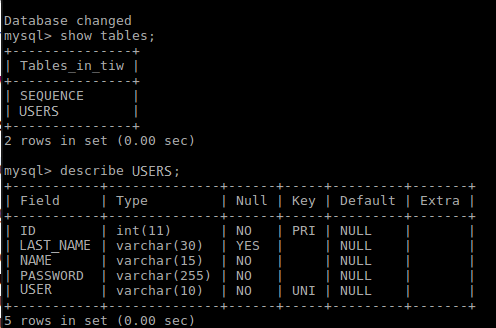
3. The test of the application should be functional and allow you to create new users, update them, and delete them,
    4. __NOTE: __ `create` will create tables if they do not exist and next the servlet will insert the records of the test users, if you plan to test and launch the application several times, it will return an exception because the records already exist for this case it is better to use 'drop-and-create`.

## Exercise3. Relations

> In this exercise it is proposed to create relationships 1-1 between entities.

1. Create a new domain `es.uc3m.tiw.lab2.domains.Address` with the following properties:
    2. `String street;`
    3. `int zipCode;`
    4. `String city;`
    5. `String country; '
6. Set a `OneToOne` relationship between User and Address.
7. Modify the edit so that when you edit a user it will be possible to add its associated address.
8. Create a new AddressDAO and AddressDAOImpl to handle the persistence of addresses
9. Add new logic to handle addresses in the servlets
10. Note how a new  `ADDRESSES` table has been created within the  `FOREIGN_KEY` in the table  `USERS`
11. Edit a user in the form and check how results are stored in tables.
12. 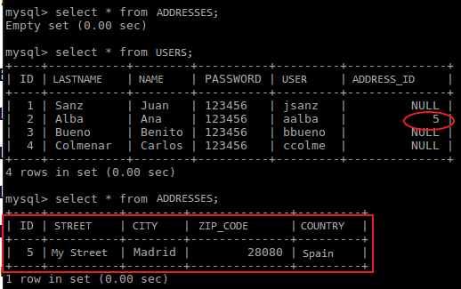

> __Recommended homework:__ Modify the project to include relationships `OneToMany` and `ManyToMany`. For example, a user can have multiple associated addresses, and an address can be shared by multiple users.
>
> JPA includes many powerful features for working with data, so please check the documentation about _Relations_, _Inheritance_, _Fetch_, _personalización of relations and tables with joinTable and JoinColumn_.
>

## ANNEX: 

### Work in Eclipse with JPA


From the __JPA perspective__ in Eclipse it is posible to work more comfortably without having to remember all the options available in JPA. To do this simply change the perspective to JPA.

Click in the name of the class or the name of some property and you will see how it changes the box below __"JPA Details"__. This lets you configure the entity with values as the table name, the schema, the generation strategy of the primary key, the constraints, or the  fetch type among other things.
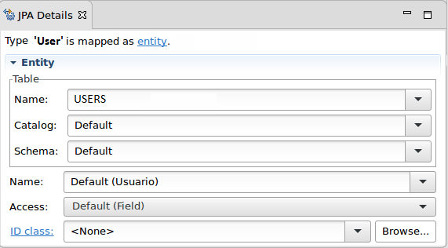 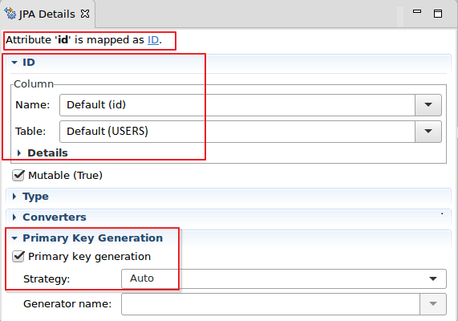 .

> __NOTE: __  to make it work it is necessary:
> 1. Write down initially the class as `@ Entity`
> 2. Save changes each time you change something. If not, the _JPA Details_ box is not updated.

JPA requires that the entities are written in the file `persistence.xml` and eclipse provides a shortcut for this work:
1. Select the entity with the right mouse button
2. Choose: __JPA Tools->ADD to Persistence Unit__

### JPA Designer

> Sometimes it is useful to have a graphical environment for managing entities and to see relationships with other entities.

Eclipse provides a graphical tool for managing entities, but it does not come installed by default.

1. Menu __Help -> Install new software__
2. In the screen that appears open the first field and select the URL associated with _Neon_
3. __When the search is finished__ and results appear, in the filter field type: _jpa_
4. Check the option __JPA Diagram Editor__ accept and continue with the installation.
5. 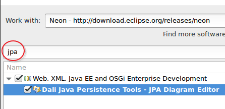 
5. You will be prompted to restart eclipse: Accept with YES.
6. After rebooting, select the _laboratories_ project with the right mouse button and __JPA Tools->Open Diagram__
7. From the diagram created you will be able to create entities and relationships.
8. If you already have created entities you can drag them onto the diagram.
9. 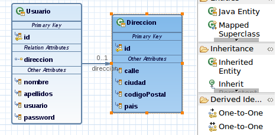

> __ATENTION:__ Do not directly delete an entity in the diagram as it also deletes the original code (option trash bin or delete), if you want to simply delete the diagram select the entity and (select the diskette icon next to the trash bin option: save and remove from diagram)

