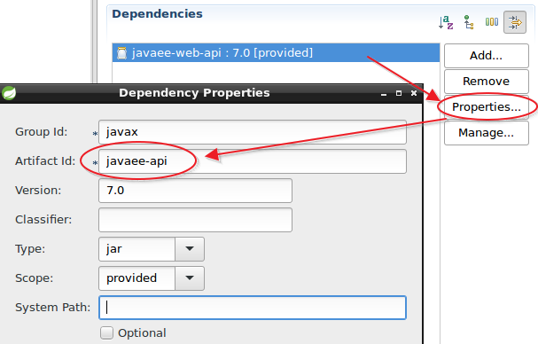
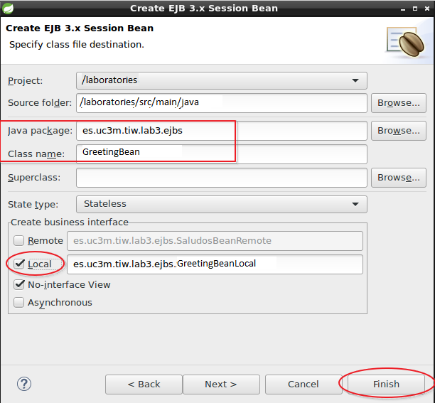
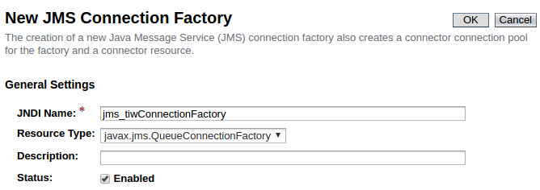
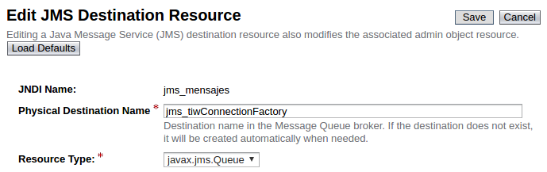
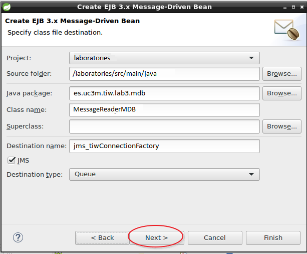
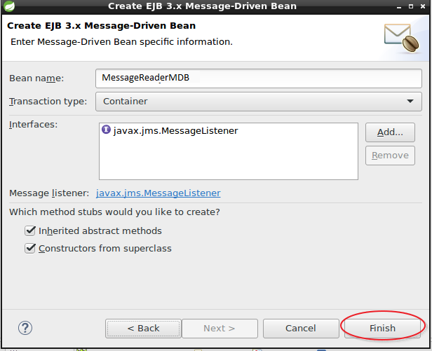

# Lab03. EJBs

>In these exercises you will learn the basics for working with EJBs

> EJB technology has always been kept separate from other modules in the JEE architecture and although it is a good practice in the __JEE7__ version EJBs is directly allowed in web projects and this approach is what we will continue in the following exercises for simplicity .
> 
> If you want to see a multi-module project you can see: [https://github.com/dpalomar/demoTIW/tree/master/demo](https://github.com/dpalomar/demoTIW/tree/master/demo).
> 
> In this case you have to pay special attention to the section `modules` within  `pom.xml` files from each project that is where relationships between modules are made. In addition eclipse needs to find the code for each project to compile so you also have to set the eclipse's _build path_ to set references.
> 


__INDEX__
<!-- MarkdownTOC  depth=3 -->

- [Exercise1. EJB SessionBean](#exercise1-ejb-sessionbean)
- [Exercise2. JMS](#exercise2-jms)
    - [Create the JMS queue in Glassfish](#create-the-jms-queue-in-glassfish)
    - [Create the code.](#create-the-code)
- [Exercise3. Refactoring persistence](#exercise3-refactoring-persistence)

<!-- /MarkdownTOC -->


## Exercise1. EJB SessionBean

> Creating a simple service is proposed to demonstrate the use of `SessionBeans` . The service will receive a `String` with a name and will return a string with a greeting by concatenating the name. the service will be called by a `Servlet` by the `GET` method.

1. Create a new package structure:

```java
    es.uc3m.tiw.lab3
                  ..\ejbs
                  ..\servlets
```
2. Open the __pom.xml__ file and change the tab __Dependencies__ `javaee-web-api-7.0` by `javaee-api-7.0` Accept and Save changes.
3.  
3. Inside the package _ejbs_ create a new `SessionBean`  __File->New->Other->EJB->SessionBean__  and call it `GreetingBean`
4. 
5. Add a new method `public String greet(String name)` both the  `local` interface and the `bean`  and the latter performs its implementation..
6. Name it __name jndi__ `name="GreetService"`
6. Create a new `es.uc3m.tiw.lab3.servlets.GreetServlet` 
    7. __Name:__ GreetServlet
    8. __URL Mapping:__ /welcome
    9. __Methods:__ doGet
10. In the servlet uses the notation  `@EJB`  to use the service `GreetingBean`
11. Recalls the  _name_ parameter that comes through  GET 
12. invokes the service with that parameter and displays the message in the browser.r.
    13. The URL will be: http://localhost:8080/laboratories/welcome?name=xxx 

> For this exercise the recommended documentation is the official [EJBs tutorial](https://docs.oracle.com/javaee/7/tutorial/partentbeans.htm#BNBLR)

## Exercise2. JMS

### Create the JMS queue in Glassfish

1. opens the Glassfish/Payara's management console
2. Find __JMS Resources->ConnectionFactories__
3. 
4. Now __JMS Resources ->Destination Resources__
5. 

### Create the code.

1. __File->New->Other->EJB->Message Drive Bean__
2. 
3. 
4. Create a new domain and name it `Message` mark it as  `@Entity` and set the following properties:

```java
    @Id
    @GeneratedValue(strategy = AUTO)
    private Long id;
    private String message;
    @OneToOne
    private User from;
    @OneToOne
    private User to;
```

5. Create the corresponding __DAOs__ for the `Message` with two methods:
    6. `findAllMessagesByUser(User user)`: will retrieve all messages for a given user.
    7. `createMessage(Message message)`: the message will persist in the table `MESSAGES` with references to user passwords.
8. Create a class `es.uc3m.tiw.lab3.util.WriteInQueue` that allows to send messages to the queue configured above
9. Create a form for sending messages and receiving servlet parameters create a `Message` and invoke to `WriteInQueue`

> The scenario is as follows:
> - A user writes a message to another using the form.
> - The servlet receives the parameters, creates the message and invokes the `WriteInQueue` service that sends the message to the server queue
> -  As comes the message to the queue, the `MessageReaderMDB` automatically receives the message (because it is a Listener)
> - `MessageReaderMDB` extract the `Message` and passes to `MessagesDAO` who writes it on a table.
> - End.

## Exercise3. Refactoring persistence

> In this exercise, it is proposed to convert DAOs session to EJBs.
> This will allow DAOs participate from the transactional server environment and therefore will not need to use the  `UserTransaction`, they neither have to wait that Servlets load the `EntityManager` since being EJBs can use the notation `@PersistenceContext` directly.
> 
> Therefore, the student is proposed refactoring DAOs and convert them to local `SessionBeans`  


1. Modify  DAOs para to use annotations `@Local` and `@SessionBean` and the same for their interfaces,following the procedure of the first exercise.
2. Modify your code so that now do not need the `UserTransaction`
3. Modify your code so that now they call upon themselves the `EntityManager`
4.  Change the code of the servlets to invoke now DAOs as `@EJB` without the need of passing the EntityManager neither the UserTransaction..
