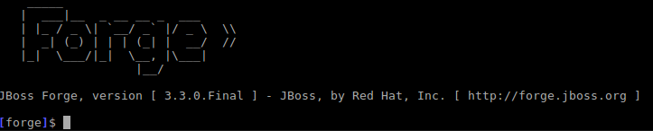
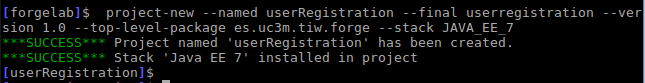
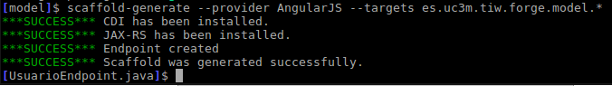
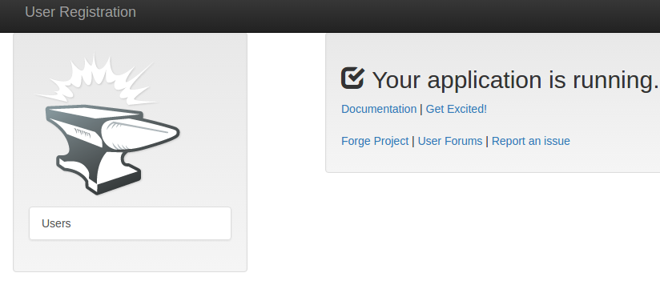
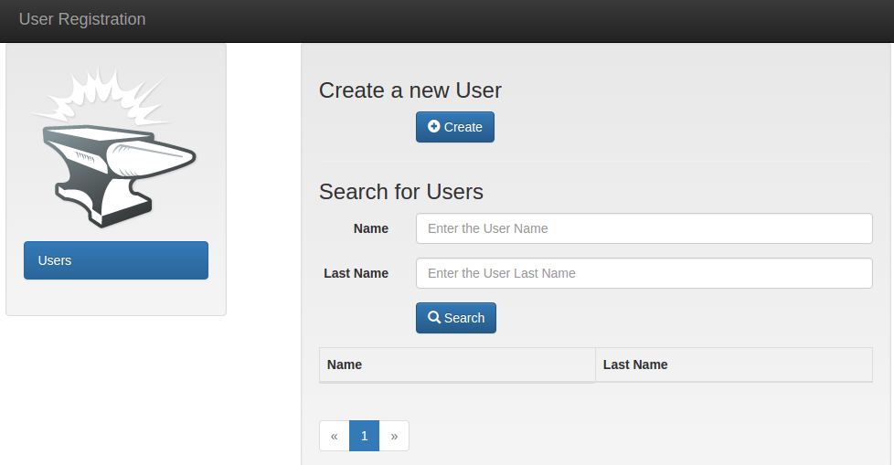
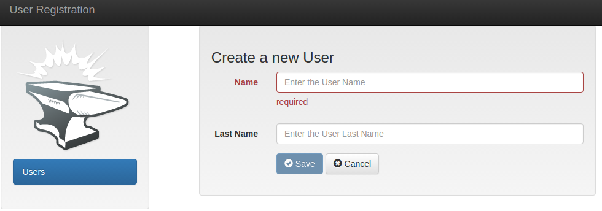
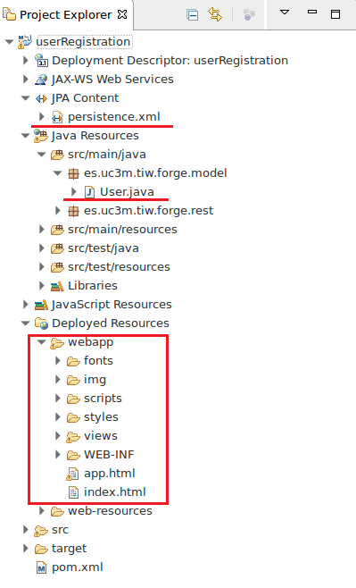

# Lab5. JBoss Forge

> JBoss Forge allows  accelerate the construction of JEE projects and although there are graphics plugins for various environments, this time we will use the console because is faster.
>
> Once acquired the necessary knowledge to work with JEE components we can use tools like [JBoss Forge](https://forge.jboss.org) that accelerate our work.

<!-- MarkdownTOC -->

- [Project creation](#project-creation)
- [Setting the persistence](#setting-the-persistence)
- [Generation of views. Scaffolding](#generation-of-views-scaffolding)
- [Deploy in the server](#deploy-in-the-server)
- [Using Eclipse](#using-eclipse)
- [Observe](#observe)


<!-- /MarkdownTOC -->


## Project creation

1. Open a terminal  _( <kbd>CTRL + ALT + T</kbd> if you use the image)_ and create a new directory:
    2. `mkdir forgelab`
    3. `cd forgelab`
3. Type the command `forge` in the terminal window and wait for the JBoss Forge console. .
4. 
5.  Enter the following command (you can use the <kbd>TAB</kbd> key to assist you and commands and parameters will start showing up):

```
 project-new --named userRegistration --final userregistration --version 1.0 --top-level-package es.uc3m.tiw.forge --stack JAVA_EE_7
```

6. Once the project is completed,  a success message will appear and the prompt will be placed in the project:. 
7. 


## Setting the persistence

1. Type the following command (use <kbd>TAB</kbd> key to assist you):

```
jpa-setup --jpa-provider Eclipse\ Link --db-type MYSQL_INNODB --data-source-name jdbc/tiw --persistence-unit-name forgelabPU 
```

2. Then:

```
jpa-new-entity --named User --idStrategy AUTO
```

3. Note that the prompt is now located in the User.java class.
4. Enter the following command to add a property `String name` with get/set methods

```
[User.java]$ jpa-new-field --named name --type String --length 20 --not-nullable 
```

5. Create another property `String lastName`

```
[User.java]$ jpa-new-field --named lastName --type String

```

## Generation of views. Scaffolding

6. Type the command `cd ..` to go up one level to the `model` package and then write the following command to generate views:
    7. You can choose between  __Faces or AngularJS__

```
[model]$ scaffold-generate --provider AngularJS --targets es.uc3m.tiw.forge.model.*  
```
8. 
9. When finished, type `build` press <kbd>ENTER</kbd> and wait until you see the following message: `***SUCCESS*** Build Success`
> __Build__ will generate a file _userRegistration.war_ in the path _target_ that you can use to deploy from the Glassfish/Payara's console.
> 

## Deploy in the server

1. Open the Glassfish/Payara server management console ([https://localhost:4848](https://localhost:4848))
2. In the lateral menu select __Applications__
3. Press __Deploy__ button
4. Press  __Choose File__ and select the file _userRegistration.war _(./forgelab/userRegistration/target/userregistration.war)_
    5. __NOTE:__ Perhaps the server show up a `warning` due to the `SEQUENCE` table that was already created by another project.
5. Navigate to the address [http://localhost:8080/userRegistration](http://localhost:8080/userRegistration) and you will se the generated application:
6. 
7. 
8. 

> The application is configured to apply validation depent on the fields and contains a user search.
> Try add some users and check in MySQL how a table `USER` has been created with added users.

## Using Eclipse

1. Delete the aplication from the Glassfish/Payara server
    2. __Payara administration console->Applications->Check "_userRegistration"->undeploy Button__
3. In eclipse:
    4. __File->Import->Maven->Existing Maven projects__
    5. .../forgelabs/_userRegistration
    6. Accept
7. If you have enabled maven console you will see how all dependencies are downloaded to configure the project.
8. At the end you will have a JEE project very similar to what we have been building.
9. 

## Observe

>
> You can check how the code has been generated and the structure. The domains are in the package `model` the ejbs in `service`.
>
> See also the `persistence.xml` file, it will not be very different from what we have created previously.
>
> You can also try to create a ejb, To that end, write in the terminal `ejb-setup` next `ejb-new-bean` if you press <kbd>TAB</kbd>  it will give you options and if you choose `--type` and you press  again <kbd>TAB</kbd> it will tell you the types of EJBs that you can use (it should be already familiar).
>

         [registroUsuarios]$ ejb-new-bean --type
            MESSAGEDRIVEN  SINGLETON  STATEFUL  STATELESS

Try other options, such as making relationships between entities, use services, create servlets, using JSF, etc. You can find many examples in the [official documentation](https://forge.jboss.org/documentation).

