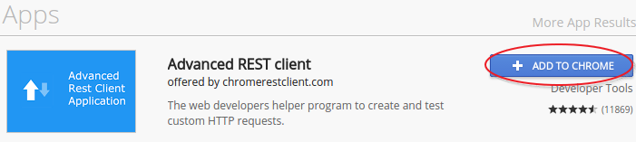
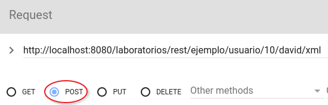
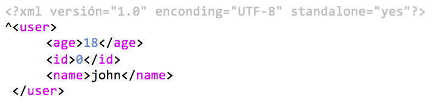
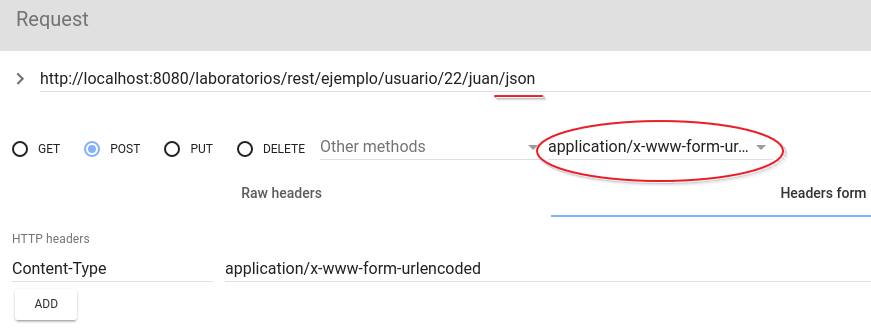
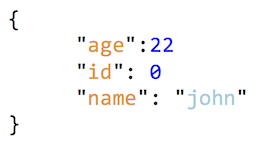

# Lab6. RESTful Services

<!-- MarkdownTOC -->

- [REST Software](#rest-software)
- [Exercise1. Configuration](#exercise1-configuration)
- [Exercise2. Service creation](#exercise2-service-creation)
- [Exercise3. Parameter passing](#exercise3-parameter-passing)
- [Exercise4. POST and documents](#exercise4-post-and-documents)
- [Exercise5. JSON](#exercise5-json)
- [Forge](#forge)

<!-- /MarkdownTOC -->

## REST Software

>You need a software that allow you to use connection methods different to GET and POST, therefor you can use the third party software __REStClient__ from [http://www.wiztools.org]() either install the Chromium plugin __Advanced REST Client__

1. Open Chromium and access to the webstore [https://chrome.google.com/webstore/category/extensions?hl=en-US]()
2. Find the __Advanced REST Client__ extension and install it.
3. 

## Exercise1. Configuration

> In this exercise we are going to create the REST infrastructure using the  __jersey__([https://jersey.java.net/]()) library that is already installed in the project dependencies and in Glassfish/Payara.
> 
> - First, it is necessary to create a configuracion class that stablish the query path to return documents with  GET, POST, PUT y DELETE petitions.
> - The Url according to this configuration will be `http://localhost:8080/laboratories/rest/`

1. Create a new package structure:

```
    es.uc3m.tiw.lab6
                  ../config
                  ../rest
```

2. Create a new `es.uc3m.tiw.lab6.config.ApplicationConfig` class than inherit from`import javax.ws.rs.core.Application`
3. The code it should contain is as follows

```java
@ApplicationPath("rest")
public class ApplicationConfig extends Application {

    public Set<Class<?>> getClasses() {
        return getRestClasses();
    }
    
    //Auto-generated from RESTful web service wizard
    private Set<Class<?>> getRestClasses() {
        Set<Class<?>> resources = new java.util.HashSet<Class<?>>();
        
        resources.add(es.uc3m.tiw.lab6.rest.ServiceExample.class);
        return resources;    
    }
}
```

## Exercise2. Service creation

> In the previous configuration class we passed the  `ServiceExample.class` class, in this exercise we are going to create it.
> 
> this class will define access to the service by setting the URLs
> 
> - the URL will be: `http://localhost:8080/laboratories/rest/example/test/...`
> 

1. Create a new `es.uc3m.tiw.lab6.rest.ServiceExample` class
2. Incorporate the _path_ notation with the path _example_
    3. `@Path("example")`
4. Create a  `getText()` method that return a `String` that only can be access by `GET`, the return content is a `plain text` and the access path will be `/test`. The code should resemble the following:


```java
@GET
        @Path("test")
        @Produces(MediaType.TEXT_PLAIN)
        public String getText() {
            return "Eveything OK";
        }
```
5. Launch the browser to the URL: [http://localhost:8080/laboratories/rest/example/test() and the response obtained should be: __Eveything Ok__

## Exercise3. Parameter passing

> In this exercise you have to make user of  `@PathParam` and `@QueryParam` notations to allow passing parameters by the URL.

1. Create a new method that accept tow parameters by URI and return a message with these parameters in plain text. The access URL will be : [http://localhost:8080/laboratories/rest/example/test/10/hi]()
2. Create another method that accept tow parameters but in another more classical way ussing `QUERY_STRING` and return a message with these parameters in plain text. The URL will be: [http://localhost:8080/laboratories/rest/example/test/query?number=10&word=hi]()

## Exercise4. POST and documents

> In this exercise we will try to use other connection methods other than `GET`, in particular ` POST`.
> The exercise will consist of writing a method that accept 2 parameters through POST, receive it and create a `User` object with those parameters and return the User object as an `XML` document.
>
> The URL will be of the type: [http://localhost:8080/laboratories/rest/example/user/18/john/xml]()
> 
> Note that the URL ends with /xml so that parameters can go anywhere in the URL.

1. Create a new method containing the following:
    2. Accept POST as connection method 
    3. Receive 2 parameters (__String nombre__ y __int edad__) by URL using `@PathParam`  
    4. Create a new User with these parameters
    5. Return the new user you have just created.
    6. Accept `plain text` as input
    7. Return `xml` as output
6.  Modify  `User` class and add an age attribute.
7.  Note `User` class with `@XmlRootElement` notation so that it is explicitly converted to xml when the service is returned.
8.  Open __Advanced Rest Client__ Chromium extension:
    9.  Invokes the access address by setting the method to `POST`
    10.  
11.  When you push on the <kbd>SEND</kbd> button you will get the respone in XML format
    12.  

## Exercise5. JSON

> In this exercise it is proposed to return a JSON document of the `User` with the same values (age and name) but this time passed by a form.
>
1. Create a new method that containts:
    2. `POST` as connection method
    3. Consume `APPLICATION_FORM_URLENCODED`
    4. Return `APPLICATION_JSON`
5. Open __Advanced REST Client__ extension
6. Configure it to send the encoded data as a form
    7. 
8. You will get an answer like this:
    9. 

## Forge

> JBoss Forge has commands to configure and generate REST services automatically and simply.
>
>  __Proposal:__
> - Look at the created code in the project _userRegistration_ and you will see REST code
> - Investigate the commands needed to create a new REST service.

