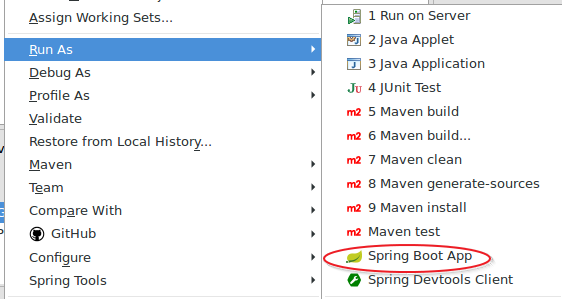
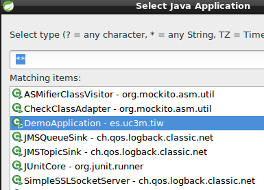

# Lab7. SpringBoot

> SpringBoot <sup id="a1">[1](#f1)</sup> is a tool of the SpringFramework family <sup id="a2">[2](#f2)</sup> that speed up development by reducing the complexity of  settings and amount of code needed to link all the modules required for the development of an application.
> 
> SpringBoot has been designed to make monolithic applications or as microservices, making the development of REST services very easy.
> 
> In this lab we will build a "spring style" application using the modules for the development complete web/REST application with the  within JPA persistence. To do this we will use the following modules:

> - SpringMVC <sup id="a3">[3](#f3)</sup>
> - SpringData <sup id="a4">[4](#f4)</sup>
> - SpringREST <sup id="a5">[5](#f5)</sup>
> - SpringHATEOAS <sup id="a6">[6](#f6)</sup>

## INDEX

<!-- MarkdownTOC  depth=3 -->

- [Exercise 1. Project setup](#exercise-1-project-setup)
    - [Execute the application](#execute-the-application)
- [Exercise 2. Web part](#exercise-2-web-part)
    - [What has happened?](#what-has-happened)
    - [Transform in a WAR](#transform-in-a-war)
- [Exercise 3. Parameters](#exercise-3-parameters)
    - [What has happened?](#what-has-happened-1)
- [Exercise 4. Views](#exercise-4-views)
    - [What has happened?](#what-has-happened-2)
- [Exercise 5. JSPs](#exercise-5-jsps)
- [Exercise 6. REST](#exercise-6-rest)
    - [What has happened?](#what-has-happened-3)
- [Exercise 7. RESTController](#exercise-7-restcontroller)
- [Exercise 8. XML](#exercise-8-xml)
- [Exercise 9. JPA](#exercise-9-jpa)
    - [What has happened?](#what-has-happened-4)
    - [Some Questions](#some-questions)
- [Exercise 10. Data REST](#exercise-10-data-rest)
- [Exercise 11. HATEOAS](#exercise-11-hateoas)
    - [What has happened?](#what-has-happened-5)
- [References](#references)

<!-- /MarkdownTOC -->

## Exercise 1. Project setup

> To create the project you can use __STS__ o [https://start.spring.io]() and put the dependencies:
> - Web, 
> - Thymeleaf, 
> - JDBC, 
> - JPA, 
> - HSQLDB, 
> - Actuator


1. Open STS and change the perspective __Spring__. 
2. Create the project with __File->New->Spring Starter Project__
3. 
4. Press  __Finish__
5. Wait unilt all dependencies have been downloaded and the project is built (you can see the state activating the maven's console) 

> Once is finalized open the __pom.xml__ file

- Inside the pom.xml file you will find a section with the following code
```xml
        <dependency>
            <groupId>org.springframework.boot</groupId>
            <artifactId>spring-boot-starter</artifactId>
        </dependency>

        <dependency>
            <groupId>org.springframework.boot</groupId>
            <artifactId>spring-boot-starter-test</artifactId>
            <scope>test</scope>
        </dependency>
```

> This two dependencies allow to import every necessary library to configure the project, for developing as much as testing. 
> 
> If you move to __Dependency Hierarchy__ tab you will see the list of libraries that have been downloaded and are necessary to work in a project like:
> - Spring-core: is the base library of springframework
> - slf4j: allow to write logs
> - mockito: library to create stubs and mock for unit testing
> 
> Everything is configured with their respective versions 

- Open `es.uc3m.tiw.DemoApplication` class and observe the code.

```java
@SpringBootApplication
public class DemoApplication {

    public static void main(String[] args) {
        SpringApplication.run(DemoApplication.class, args);
    }
}
```

- This class is the one that allow to launch the application independently without the application server 
    - The annotation `@SpringBootApplication` configure every parameter necessary to work.
    - Inside the `main()` method `SpringApplication.run` execute the configuration class, in this example it is `DemoApplication` class itself although  we don't have a custom configuration, something that we can modify.
    - This way we can execute the class as if it was a normal class and it will open tomcat embedded with the application inside.
        - If we wanted to deploy the application in our own server we should modify the pom.xml file so that instead of the jar file it will be the war the file created and change the code of this class as we shall see.

### Execute the application

1. Select the project and the right button __Run As->Spring Boot App__
    2. 
2. __Opcional:__ If you don't have STS and you work with eclipse you can choose __Run As->Java Application__
    3. Eclipse will show a list of executable classes that have the _main_ method, select the `DemoApplication` class and go
    4. 

## Exercise 2. Web part

> In this exercise we are going to configure dependencies to convert the project in a web project to be able to work with the components of the control layer. 

- Modify the following code in the __pom.xml__ file

```xml
        <dependency>
            <groupId>org.springframework.boot</groupId>
            <artifactId>spring-boot-starter</artifactId>
        </dependency>
```

- By this one:

```xml
        <dependency>
            <groupId>org.springframework.boot</groupId>
            <artifactId>spring-boot-starter-web</artifactId>
        </dependency>
```

- Save the changes.
- Create a new class (regular class, not a serlvet) `es.uc3m.tiw.controllers.MyFirstController`  
- Note down the class with the `@Controller` anotation (you have to import it). This identify the class as a web component for Springframework
- Create a `String greet()` method that return a String.
- Note down the method with the `@RequestMapping("/greet")` annotation. This anotation will define the access URL
- Note down the return type as `@ResponseBody`. This annotation will define the response body
- The class shoud be like this:

```java
    @Controller
    public class MyFirstController {

        @RequestMapping("/greet")
        public @ResponseBody String greet(){
            return "Hi";
        }
    }
```

- Execute the application and launch the web browser to the address: [http://localhost:8080/greet]()
    - You will recibe the message _Hi_ in the screen.

### What has happened

1. When you note down a class as `@Controller` automatically stop being a regular class to convert in a web controller that is able to receive objects `request` and `response`
2. SpringBoot scans all the classpath searching noted class and load them directly.
3. `@RequestMapping` define the input URL, as well as every parameters and atributes asociated to the `HttpServletRequest` object
4. `@ResponseBody` allow to modify the `HttpServletResponse` object in this case the return`String` type it is converted in the response body therefore the _"Hi"_ string will be transmitted implicitly with the _text/plain_ header
5. When the application is started, SpringBoot generate every artifact so that the application show up with an embedded tomcat and the   _demo_ project as the default context, therefore you shouldn't go to _http://localhost:8080/demo/greet_, just   _http://localhost:8080/greet_
    6. The full URL with the context should be done in case we deployed in a external server (like Glassfish) that is able to keep many contexts.

### Transform in a WAR

> This part is optional and is shown as an example in case we wanted to use a more traditional workflow deploying in an application server.


1. Open the __pom.xml__ file and localize the following line of code `<packaging>jar</packaging>` change the value of _jar_ by _war_
2. Open `DemoApplication` class and make it inherit from `org.springframework.boot.web.support.SpringBootServletInitializer`
3. Override the `configure` method.
4. The class should remain like this:

```java
@SpringBootApplication
public class DemoApplication extends SpringBootServletInitializer{

    /**
     * Used when is a JAR
     * @param args
     */
    public static void main(String[] args) {
        SpringApplication.run(DemoApplication.class, args);
    }
    
    /**
     * Used when is a WAR
     */
    @Override
    protected SpringApplicationBuilder configure(SpringApplicationBuilder builder) {
    
        return builder.sources(DemoApplication.class);
    }
}
```

> __An error will show up__ in red in the project and the _problems_ tab will indicate that the project is not up-to-date. This is caused because we have changed the pom.xml configuration file.
> 
> To fix it just right click the project and select : __Maven->Update Project__

> __NOTE:__ Before being able to deploy in a server is necessary to eliminate the CloudFoundry configurations  <sup id="a7">[7](#f7)</sup>. To do this press right button  the project and choose: __configure->Disable as Cloud Foundry APP__

- Launch the server (can be Glassfish or Pivotal tc Server, the later is a tomcat modified)
- Deploy the application in the server. You will see the same messages in the console than before .
- Launch the web browser and go to  _http://localhost:8080/greet and it will return a 404 error page.
- Try again with the new address [http://localhost:8080/demo/greet]() and you will see the response string.

## Exercise 3. Parameters

> In this exercise we are coing to see how to recibe parameters from the client .

1. Create a new method called __parameters__ that recive two parameters, a `String` and an `int`.
2. Resolve the code in this way:

```java
    @RequestMapping("/params/{name}/{age}")
    public @ResponseBody String parameters(@PathVariable String name, @PathVariable int age){
        return "Parameters are: "+name+" & "+age;
    }
```

3. Launch the application and launch the web browser the following URL: [http://localhost:8080/params/john/22]()
4. You will recive a message similar to this: _"Parameters are john & 22"_

### What has happened

- In `@RequestMapping` it is defined the URL structure and it is indicated by braces `{variable}` that it will be a series of parameters with a variable value.
- This variable names have to coincide with the ones that the method receive
- `@PathVariable` annotation indicate to SpringBoot that parameters will be received throught their position in the URI.
    - Another option should be use a traditional `QUERY_STRING` with the  `@RequestParam` annotation
- Spring carries out automatically the conversion of the received types to the expected. For instance, _age_ it is received as a String (everything coming by HTTP is in String format) and is converted automatically in a int.
    - Spring carries out the automatically conversion if is possible. That include complex types like collections, arrays, lists, own objects, etc.
    - If is not possible to carry out the conversion, for example if is introduce age in a not numeric String, the server will return a __406 Not Acceptable Response__ error 
> You can obtain more information about passing parameters in __RequestMapping__  documentation <sup id="a12">[12](#f12)</sup>.

## Exercise 4. Views

> SpringBoot can work with JSPs and templates like Tiles <sup id="a8">[8](#f8)</sup>, Velocity <sup id="a11">[11](#f11)</sup>, Freemarker <sup id="a9">[9](#f9)</sup> or Thymeleaf <sup id="a10">[10](#f10)</sup>.
> 
> __Thymeleaf__ is a template framework which their best advantage is that it can be use without the need or running on a application server, so it is possible to obtain a vision about the graphical interface aspect without the need of incorporate data from the server.
> It uses a sintasix very similar to JSP and taglibs JSTL, consequently the leap from JSP+JSTL development is very fast.

1. Open __pom.xml__ file and add the following code inside the _dependencies_ section
2. Save the changes.
```xml
        <dependency>
            <groupId>org.springframework.boot</groupId>
            <artifactId>spring-boot-starter-thymeleaf</artifactId>
        </dependency>
```

1. Create a new _folder_ in `src/main/resources` and name it __templates__
2. Inside the folder, create a new empty file called __hello.html__
3. Write the folling code:

```html
<!DOCTYPE html>
<html>
<body>
    <p>
        Hi <span th:text="${name}">name-goes-here</span> from a Thymeleaf page
    </p>
</body>
</html>
```

> __Note the following:__ Html code is normal, but inside the `<span>` tag it has been introducing thymeleaf code that will replace the string _"name-goes-here"_ by the _name_ parameter that is sent in the _request_ in case it exists. Otherwise it will keep the String inside the _span_ tag. 

1. Modify the `greet()` method from the `MiPrimerController` to receive a _"name"_ parameter of `String` type.
2. The method should request a `org.springframework.ui.Model` Spring object where the name received will be inserted and will be forward to that "model" to the page that have the same name.
    3. The parameter inserted in the model object will be called _"name"_.
4. Take out the `@ResponseBody` annotation
5. In the `return` write the _"hi"_ String (in lowercase).
3. The code is the following:

```java
	@RequestMapping("/greet/{name}")
	public String greet(Model model, @PathVariable String name){
		model.addAttribute("name", name);
		return "hello";
	}
```

- Launch the application again and open the address: [http://localhost:8080/greet/john]() in your browser.
    - you will receive the following message: _"Hi john from from a Thymeleaf page"_

### What has happened

- If we eliminate the  `@ResponseBody` annotation SpringBoot understand that the return type, if is a String, is a view and not the reponse body like before.
- If the response is in a view, SpringBoot will use the `ViewResolver` component that have configured (can be a JSP, Freemarker, Velocity, etc.), in this case is __Thymeleaf__ and the default configuration will look for the pages in the _templates_ folder
- The return String will be the page name. This way we return "hi", SpringBoot will return the  _"templates/hello.html"_ page. If we returned "app/hello", SpringBoot would look for the _"templates/app/hello.html"_ page
- SpringBoot use __MVC__ pattern and understan if there are a page as a view, then you can pass it a model. `Model` object is an object that is automatically sent the specific viw in the `return` and any attribute that we put there will be reciven bvy the page.
    - When `Model` object is requested as a attribue from the `greet()` method Spring will inject it  automatically and we don't have to worry about doing make an instance of the object with `new` sentence.
    - If there are a `Model` always will be sent to the view
    - It is admitted another obkects as model, for example we can use a `java.util.Map`
- The `name` attribute from the `Model` object is received by the Thymeleaf page with the `th:text="${name}"` notation

> Documentation about return types in SpringMVC <sup id="a13">[13](#f13)</sup>.
> 
#### To sum up

1. To finish ope the `src/templates/hello.html` page directly with a web browser
    2. You will se a message: _"Hi name-goes-here from a thymeleaf page"_
3. This happens because the petition is not processed by a server, buy the unlike JSP pages you will not see the source code in a  `<% ... %>` style.
    4. Esto permite a los diseñadores/integradores trabajar en el diseño con datos temporales que serán sustuidos por los reales y ver un aspecto más cercano al final sin tener que subirlo a un servidor para comprobar si encaja bien el diseño.


## Exercise 5. JSPs

> ¿What happens if I want to work JSPs as a part of the view? In this exercise will show how to do it.

- Create a path structure like the following (beware with uppercase/lowercase):

```
 src/main/webapp/
                |
                 /WEB-INF/
                         |
                          /views
```
 
 - Move the `hello.html` page to the folder `src/main/webapp/WEB-INF/views`
 - Rename the page to `hello.jsp`
 - Modify the code from the page to remain like this:

```html
    <p>
        Hi ${name} from a JSP page
    </p>
```

- Remove the Thymeleaf dependency from the __pom.xml__ file that you added previously.
- Now, SpringBoot will be configured by default to use a `InternalResourceViewResolver` instead of a   `ThymeleafViewResolver` and we have to configure where it has to find the pages:
    - Open the  `src/main/resources/application.properties` file
    - Write the following code:

```

    spring.mvc.view.prefix=/WEB-INF/views/
    spring.mvc.view.suffix=.jsp

```


- Now the path to the pages will be compound by  _prefix_+return+_suffix_, so that the controller will return  _"hi"_ and spring will look for the  _WEB-INF/views/hello.jsp_ page
    - As you see, we have modified views and their configuration but not the controller, it will keep on returning the same String without regard who is the `ViewResolver`

> __WARNING:__ this JSPs configuration only will work in an application server and with a .war file, but it won't work with an embedded tomcat and a .jar file. Just as is discussed in the documentation <sup id="a14">[14](#f14)</sup>.
> 
> If you are going to work with JSPs with an external server like Tomcat, Glassfish, JBoss, Jetty or similar then it is recommended that you introduce the following code in the  _pom.xml_ file not to double the Servlet and JSP libraries
> 

```xml
        <dependency>
            <groupId>org.springframework.boot</groupId>
            <artifactId>spring-boot-starter-tomcat</artifactId>
            <scope>provided</scope>
        </dependency>
```

## Exercise 6. REST

1. Create two new classes `es.uc3m.tiw.domains.User` and `es.uc3m.tiw.domains.Address`
    2. User properties :
        3. `String name`
        4. `int age`
        5. `Set<Address> address`
    6. Address properties:
        7. `String street`
        8. `int zip_code`
9. Complete with getters/setters and constructors
10. Open the controller `MyFirstController` and create a `void init()` method where you will create some address and a user with these addresses.
11. Note the `init()` method with the  `@PostConstruct` notation. 
    12. This notation will allow to load this method after the first invocation  of SpringBoot

```java
        @Controller
        public class MyFirstController {

            private User user;
            
            @PostConstruct
            public void init() {
                Set<Address> addresses = new HashSet<>();
                addresses.add(new Address("first avenue", 1111));
                addresses.add(new Address("second avenue", 2222));
                
                user = new User("user", 11, addresses);
            }
```

- Create a new method called `hiUser()` like the following:

```java
    @RequestMapping("/user")
    public @ResponseBody Usuario hiUser(){
        return user;
    }
```
- Execute the application and open a web browser with the address: [http://localhost:8080/user]()
    - You will get the following respone in JSON format:

```json
    {
      "name": "user1",
      "age": 11,
      "address": [
        {
          "street": "first avenue",
          "zip_code": 1111
        },
        {
          "street": "second avenue",
          "zip_code": 2222
        }
      ]
    }
```

### What has happened

> Again if Spring can convert something it will. In this case we won't return a page neither a `String`, we will return a `User` object that internally contains a collection of `Address` objects.
> SpringBoot is configured automatically to return this kind of obects as a JSON document.
> The `@ResponseBody` notation return a `User` object as a document inside the respone message and not as the name of a logic view.
> 

## Exercise 7. RESTController

> As we have seen, we can return an object and SpringBoot will return it as a JSON document.
> 
> If we want make controllers that exclusively consume and return JSON documents and not participate in the views , Spring provide a special notation: `@RestController`

1. Change the `@Controller` notation by `@RestController`
2. Drop the `@ResponseBody` notation from the method
3. Try it. Once again you will get the same answer, but the previous methods that use views will not work any more.

```java
@RestController
public class MyFirstController {

    @RequestMapping("/user")
    public User hiUser(){
        return user;
    }
}
```
## Exercise 8. XML

> In this exercise you will learn how to return documents in XML format instead of JSON or both.
> 

1. Open the `User` class and note it with the `@XmlRootElement` notation
2. Refresh the application and open the web browser again.
    3. Now tou will get an XML response

```xml
<user>
    <address>
        <steet>first avenue</steet>
        <zip_code>1111</zip_code>
    </address>
    <address>
        <steet>second avenue</steet>
        <zip_code>2222</zip_code>
    </address>
    <age>11</age>
    <name>user1</name>
</user>
```
> To alternate between  JSON and XML just write the prefix in the URL:
> 
> [http://localhost:8080/user.json]()
> [http://localhost:8080/user.xml]()

> Agin Spring separate controlles from the model, we have modified the `User` class but not the controller.
> 


## Exercise 9. JPA

1. In the __pom.xml__ file add the following dependencie and save the changes:

```xml
        <dependency>
            <groupId>org.springframework.boot</groupId>
            <artifactId>spring-boot-starter-data-jpa</artifactId>
        </dependency>
```
2. Note the domains as __entities__, create a primary key to them and set a relationship  one-to-many between `User` and `Address`.
    1. If you need to go over, review the laboratory2. Persistence
3. Add the following dependency in the __pom.xml__ file to obtain a database that will work in memory.

```xml
        <dependency>
            <groupId>com.h2database</groupId>
            <artifactId>h2</artifactId>
        </dependency>
```

4. Create ann __Interface__ in `es.uc3m.tiw.daos.UserDao` and make it inherit the  `org.springframework.data.repository.CrudRepository` interface
5. Add the s `List<User> findAll();` and `User findByName(String name);` persitence methods
    1. The code will remain like this:

```java
public interface UserDao extends CrudRepository<Usuario, Long> {

    List<User> findAll();
    User findByNombre(String name);
}
```
6. Cut the `init()` method from the controller and paste it in the `DemoApplication` class(the `@PostConstruct` anotation included).
7. In the `DemoApplication` class inject the`UserDao` with the following code:

```java
    @Autowired
    private UserDao dao;
```
8. Complete the `init()` method with the following code to store the user in the database: 

            dao.save(user);

9. In the controller make the following changes:
    1. Inject the`UserDao`
    2. Modify the method to receive a parameter (name) in the URL
    3. Call the `findByNombre` method from the dao 
    4. Return the user found.
10. Save the changes and restart the application
    1. Now you will see in the console traces from `hibernate` and `hsqldb` creating the tables.
11. Open in the web broser the address [http://localhost:8080/usuario/usuario1]() and you will obtain in XML format the information from the user.

```xml
<user>
    <address>
        <steet>first avenue</steet>
        <zip_code>1111</zip_code>
	<id>2</id>
    </address>
    <address>
        <steet>second avenue</steet>
        <zip_code>2222</zip_code>
	<id>1</id>
    </address>
    <age>11</age>
    <id>1</id>
    <name>user1</name>
</user>
```

### What has happened

> A pile of things:
> - The `spring-boot-starter-data-jpa` dependency have downloaded `hibernate` and`javax.persistence`, have configured tje persitence unit and the `DataSource` and it allows us to work with JPA notations making use of the __SpringData__ project.
> - The `com.h2database.h2` dependency download the __h2__ database, it is a database write in java and very light because by default operate in memory and it is perfect for testing environments.
> - SpringData have benn downloaded and configured directly and it allow us to write `@Repositories` that are components knowed by Spring for persistence. Something similar to `@Controllers` in the web part
> - SpringData encapsulate many of the basic logic from the CRUD by a series of interfaces and making use of Aspect-Oriented Programming (AOP). 
>   - We just need to define the operations and the spring "magic" create the code underneath.
> - The `@Autowired` anotation are propietary of Spring and allow us to make injections of objects in other components, Similary, what a `@Inject` notation make in JEE.
>   - Spring in its last versions also admit `@Inject` notations

### Some Questions

- ¿Where is the `persistence.xml` file?
- ¿Where is the code from `UserDaoImpl`?
- ¿Where is the database's driver ?
- ¿Where are captured the exceptions?
- ¿How to use our won database, for example MySQL?
- ¿How to modify the properties to see JPA traces?

> This answers can be found in the SpringBoot documentation <sup id="a15">[15](#f15)</sup>


## Exercise 10. Data REST

> Modern architectures and oriented to REST services some times  arquitecturas modernas y orientadas a servicios REST a veces go without intermediate layers like DAOs or Services and exponen directly REST operations as dinamic Repositories.
> 
>  In this exercise you will learn what utilities provide SpringBoot to create this kind of scenes.

1. Add the following dependency to the __pom.xml__ file and save the changes:

```xml
        <dependency>
            <groupId>org.springframework.boot</groupId>
            <artifactId>spring-boot-starter-data-rest</artifactId>
        </dependency>
``` 
2. Note the `UserDao` class with `@RestResource(path="users",rel="users")`.
3. Save changes, restart the application and open [http://localhost:8080/users]() in your web browse ,  you will get the following output:

```json
{
  "_embedded" : {
    "users" : [ {
      "name" : "user1",
      "age" : 11,
      "address" : [ {
        "street" : "first avenue",
        "zip_code" : 1111
      }, {
        "street" : "second avenue",
        "zip_code" : 2222
      } ],
      "_links" : {
        "self" : {
          "href" : "http://localhost:8080/users/1"
        },
        "user" : {
          "href" : "http://localhost:8080/users/1"
        }
      }
    } ]
  },
  "_links" : {
    "self" : {
      "href" : "http://localhost:8080/users"
    },
    "profile" : {
      "href" : "http://localhost:8080/profile/users"
    },
    "search" : {
      "href" : "http://localhost:8080/usuarios/search"
    }
  }
}
```

- __Observe:__ 
    - Now users are inside a new section  **_embedded**
    - Appear links inside the secction  **_links** that allow to navigate by primary keys.
    - If you observe the eclipse's console you will se new automatic mappings:

```
[0;39m Mapped "{[/{repository}/{id}],methods=[DELETE],produces=[application/hal+json || application/json || application/*+json;charset=UTF-8]}" 
[0;39m Mapped "{[/{repository}/{id}],methods=[OPTIONS],produces=[application/hal+json || application/json || application/*+json;charset=UTF-8]}"
[0;39m Mapped "{[/{repository}/{id}],methods=[HEAD],produces=[application/hal+json || application/json || application/*+json;charset=UTF-8]}"
[0;39m Mapped "{[/{repository}/{id}],methods=[GET],produces=[application/hal+json || application/json || application/*+json;charset=UTF-8]}"
[0;39m Mapped "{[/{repository}/{id}],methods=[PUT],produces=[application/hal+json || application/json || application/*+json;charset=UTF-8]}"
```
- Try to make some queries with `GET` using the __Advanced REST Client__ plugin from Chrome
- Carry out a data modification from the user using `PUT`
    - You will have to user headers of `application/json` type and send the data as a `JSON` object
    - For instance you can send the following document:

```json
{
  "name" : "usuario1",
  "age" : 33,
  "address" : [ {
    "street" : "first avenue",
    "zip_code" : 1111
  }, {
    "street" : "second avenue",
    "zip_code" : 2222
  }, {
    "street" : "three avenue",
    "zip_code" : 333
  }  ]
}
```
- Whe youcarry out the query by `PUT` in the URL: [http://localhost:8080/users/1]() you will receive an empty response and a `204` code indicating that it has been modifying successfully. But, when you try again the query by `GET` you will get a new `JSON` with the modified data: __age__ and a __new address__.

## Exercise 11. HATEOAS

> HATEOAS allow us to create Hipermedia documents using the REST links to navigate between petitions and repositories as it was html.
> 

1. Create a new __Interface__ `es.uc3m.tiw.daos.AddressDao` the same way that UserDao` and with a `@RestResource(path="addresses",rel="addresses")`
2. Do not introduce any method, leave the interface body emtpy.
3. Save and reload. Open [http://localhost:8080/usuarios/1/"]() in your web browser and you will get a new link:

            http://localhost:8080/users/1/address

4. If you use [ARC](https://advancedrestclient.com/) or a plugin that allow you to navigate in JSON, like  [JSON formatter](https://github.com/callumlocke/json-formatter) you will be able to make click in the previous link and you will see every address asociated with that user, they are also navigable with generated links.

### What has happened?

- Spring-Data-REST allow to expone the repositories directly as REST services.
- This allow us to  permite carry out CRUD operations with HTTP methods easily
- Spring-Data-REST allow us to navigate through linked domains data  by relationships `OneToOne`, `OneToMany`, etc. as if they were hipermedia documents.


---

## References

- <b id="f1">1</b>: [SpringBoot](http://projects.spring.io/spring-boot/) [↩](#a1)
- <b id="f2">2</b>: [SpringFramework](http://spring.io) [↩](#a2)
- <b id="f3">3</b>: [Spring MVC](http://projects.spring.io/spring-framework/)  [↩](#a3)
- <b id="f4">4</b>: [Spring Data](http://projects.spring.io/spring-data/) [↩](#a4)
- <b id="f5">5</b>: [Spring REST](http://docs.spring.io/spring-data/rest/docs/current/reference/html/) [↩](#a5)
- <b id="f6">6</b>: [Spring HATEOAS](http://projects.spring.io/spring-hateoas/) [↩](#a6)
- <b id="f7">7</b>: [CloudFoundry](https://pivotal.io/platform) [↩](#a7)
- <b id="f8">8</b>: [Tiles](https://tiles.apache.org/) [↩](#a8)
- <b id="f9">9</b>: [Freemarker](http://freemarker.org/) [↩](#a9)
- <b id="f10">10</b>: [Thymeleaf](http://www.thymeleaf.org/) [↩](#a10)
- <b id="f11">11</b>: [Velocity](http://velocity.apache.org/) [↩](#a11)
- <b id="f12">12</b>: [RequestMapping](http://docs.spring.io/spring/docs/5.0.0.M1/spring-framework-reference/htmlsingle/#mvc-ann-requestmapping) [↩](#a12)
- <b id="f13">13</b>: [Supported Return types](http://docs.spring.io/spring/docs/5.0.0.M1/spring-framework-reference/htmlsingle/#mvc-ann-return-types) [↩](#a13)
- <b id="f14">14</b>: [JSP limitations](http://docs.spring.io/spring-boot/docs/current/reference/html/boot-features-developing-web-applications.html#boot-features-jsp-limitations) [↩](#a14) 
- <b id="f15">15</b>: [Documentación SpringBoot](http://docs.spring.io/spring-boot/docs/current/reference/html/) [↩](#a15)
